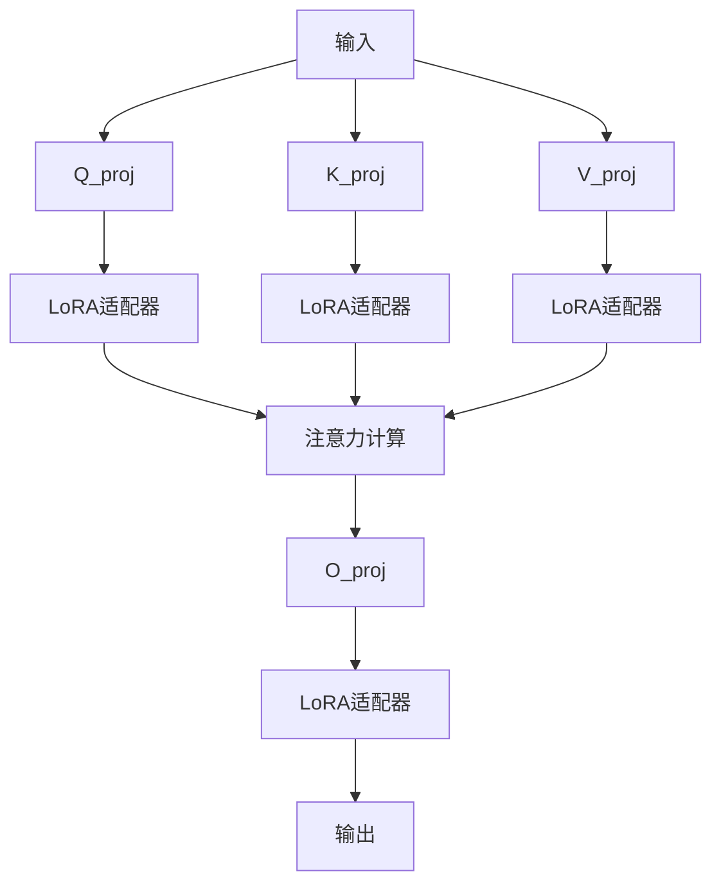

# LoRA和低秩矩阵详细解释（小白版）

## 什么是矩阵的"秩"？

### 1. 从简单例子开始

想象一个**2×3的矩阵**：
```
[1 2 3]
[4 5 6]
```

这个矩阵的**秩是2**，因为：
- 第一行：[1, 2, 3]
- 第二行：[4, 5, 6] = 4 × [1, 2, 3] - [0, 3, 6]
- 第二行不是第一行的简单倍数，所以需要两行来表达

### 2. 秩的直观理解

**秩** = 矩阵的"信息复杂度"或"独立程度"

- **秩1**：所有行都是同一行的倍数（很简单）
```
[1 2 3]      ← 这一行
[2 4 6]  ← 这是第一行的2倍（秩=1，很简单）
```

- **秩2**：需要两行才能表达（稍微复杂）
```
[1 2 3]      ← 第一行
[1 3 5]  ← 不是第一行的倍数，需要第二行（秩=2）
```

### 3. 高维例子

在深度学习中，矩阵可能是**1000×1000**：
- **秩1000**：完全独立，1000行都不相关（非常复杂）
- **秩10**：大部分信息可以用10个基本模式表达（相对简单）
- **秩1**：所有信息都可以用1个基本模式表达（非常简单）

### 4. 秩的实际意义

**类比：颜色表达**
- **高秩**：需要很多颜色来描述（复杂图片）
- **低秩**：用几种基本颜色就能表达大部分信息（简单图片）

**类比：音乐**
- **高秩**：复杂的交响乐，需要很多乐器
- **低秩**：简单的民谣，用几种乐器就够了

## 什么是低秩分解？

### 1. 核心思想

**原始矩阵**：A (大小：m×n，复杂)
```
A = [m×n的复杂数据]
```

**低秩分解**：用两个简单矩阵相乘来近似A
```
A ≈ P × Q
其中：P是 m×r 矩阵（r << m,n）
     Q是 r×n 矩阵（r << m,n）
```

**关键**：r就是秩，表示用多少个"基本模式"来表达原始信息

### 2. 数字例子

假设我们有用户-电影评分矩阵（5个用户对4部电影的评分）：
```
原始矩阵 A (5×4)：
用户1: [5 4 0 0]  ← 看过电影1,2，没看过3,4
用户2: [5 5 0 0]  ← 看过电影1,2，没看过3,4
用户3: [0 0 5 4]  ← 没看过电影1,2，看过3,4
用户4: [0 0 4 5]  ← 没看过电影1,2，看过3,4
用户5: [4 5 0 0]  ← 看过电影1,2，没看过3,4
```

**低秩分解（秩=2）**：
```
模式矩阵 P (5×2)：         权重矩阵 Q (2×4)：
用户1: [0.8 0.1]          电影1: [6 0 0 0]  ← 动作片模式
用户2: [1.0 0.0]          电影2: [5 5 0 0]  ← 动作片模式
用户3: [0.0 0.9]          电影3: [0 0 5 4]  ← 爱情片模式
用户4: [0.0 1.0]          电影4: [0 0 4 5]  ← 爱情片模式
用户5: [0.7 0.2]
```

**解释**：
- **P矩阵**：每个用户对"动作片"和"爱情片"的偏好
- **Q矩阵**：每部电影在"动作片"和"爱情片"方面的特征
- **秩=2**：用2个基本模式（动作片、爱情片）就能解释大部分评分

### 3. 为什么低秩有效？

现实世界的数据往往有**隐藏结构**：
- 用户的偏好有规律（喜欢动作片的人不太可能讨厌爱情片）
- 文本有语法模式（主谓宾结构）
- 图像有空间结构（相邻像素相关）

**低秩分解就是找出这些隐藏模式！**

## LoRA（Low-Rank Adaptation）详解

### 1. 基本原理

在深度学习中，预训练模型的权重矩阵通常是**高秩**的，因为它们学到了很多复杂模式。

**LoRA的想法**：
```
原始权重 W (高秩，复杂) = 预训练好的完整知识
LoRA权重 ΔW (低秩，简单) = 特定任务的适配知识
最终权重 = W + ΔW
```

**关键**：只训练低秩的ΔW，不修改原始的W！

### 2. 具体实现

假设有一个注意力层的查询投影矩阵：
```
原始矩阵 W: 4096×4096 (约1600万参数)
```

**LoRA实现**：
```python


# 用两个小矩阵代替原始矩阵，
W_lora_A: 4096×16   (约6.5万参数)  # 降维
W_lora_B: 16×4096     (约6.5万参数)  # 升维
总参数：约13万 vs 原来的1600万 (减少99.2%)

# 前向传播时
def forward(x):
    # 假设 x 的形状是 (batch_size, 4096)

    # 原始路径：完整的矩阵乘法
    original_out = x @ W  # (batch_size, 4096) @ (4096, 4096) = (batch_size, 4096)

    # LoRA路径：通过小矩阵的矩阵乘法
    lora_out = x @ W_lora_A @ W_lora_B
    # 步骤1：x @ W_lora_A = (batch_size, 4096) @ (4096, 16) = (batch_size, 16)
    # 步骤2：(batch_size, 16) @ W_lora_B = (batch_size, 16) @ (16, 4096) = (batch_size, 4096)

    # 合并结果
    return original_out + lora_out  # (batch_size, 4096) + (batch_size, 4096) = (batch_size, 4096)
```
PS：

  1. 矩阵大小对比

  原始矩阵 W:
  大小：4096 × 4096
  参数：4096 × 4096 = 16,777,216 个参数
  这就像：需要记住1600万个数字！

  LoRA方案：
  W_lora_A: 4096 × 16 = 65,536 个参数
  W_lora_B: 16 × 4096 = 65,536 个参数
  总计：65,536 + 65,536 = 131,072 个参数
  这就像：只需要记住13万个数字！

  节省：16,777,216 - 131,072 = 16,646,144 个参数
  节省比例：99.2%


### 3. 参数解析（你的配置）

```python
peft_config = {
    "r": 16,                    # 秩：中间维度，控制适配器大小
    "lora_alpha": 32,            # 缩放：放大LoRA效果
    "lora_dropout": 0.05,         # 正则化：防止过拟合
    "target_modules": [            # 目标层：在哪些层添加LoRA
        "q_proj",               # 查询投影（注意力机制中的"我要什么"）
        "k_proj",               # 键投影（注意力机制中的"我有什么"）
        "v_proj",               # 值投影（注意力机制中的"我给什么"）
        "o_proj"                # 输出投影（注意力机制的汇总）
    ]
}
```

**详细解释**：

#### `r": 16` 的含义：
- **16**：中间表示的维度
- **太小（如4）**：表达能力不足，可能学不会你的任务
- **太大（如128）**：参数太多，可能过拟合，失去效率优势
- **16**：在表达能力和效率间的平衡点

#### `lora_alpha": 32` 的含义：
- **公式**：`lora_out = lora_out * (alpha / r)` ，这样乘上放大器就变化明显了
- **实际效果**：放大因子 = 32/16 = 2.0
- **作用**：确保LoRA的贡献不被"淹没"在原始输出中
总结：alpha / r 就是一个放大倍数，确保LoRA的小参数贡献能够对大模型的输出产生足够的影响，就像给小声的声音加上扩音器！

#### `target_modules` 的含义：


**为什么选择这些层**：
1. **注意力机制是Transformer的核心**
2. **投影层决定了信息如何被提取和组合**
3. **修改这些层最有效改变模型行为**

### 4. 训练过程对比

#### 传统全量微调：
```
第1步：加载38亿参数的模型
第2步：计算所有38亿参数的梯度
第3步：更新所有38亿参数
第4步：重复，直到收敛
内存需求：38亿参数 × 4字节 × 2(梯度) = 30GB+
```

#### LoRA微调：
```
第1步：加载38亿参数的模型（冻结）
第2步：添加300万参数的LoRA适配器
第3步：只计算300万参数的梯度
第4步：只更新300万参数
第5步：重复，直到收敛
内存需求：38亿×4 + 300万×4×2 = 15GB
```

### 5. 实际效果

**例子：让通用GPT学会写你的代码风格**

**不使用LoRA**：
```
输入："写一个Python函数"
原始输出："def function():\n    pass"  # 通用风格
```

**使用LoRA训练后**：
```
输入："写一个Python函数"
输出：
"def function():
    '''\n    这是一个函数\n    '''\n    return None"  # 你的风格（带注释）
```

**关键优势**：
1. **保持原始能力**：通用编程知识不丢失
2. **添加特定风格**：学会你的编码习惯
3. **参数效率高**：只训练1%的参数

### 6. 数学原理

**原始矩阵分解**：
```
W_new = W_old + ΔW
其中 ΔW = A × B (秩为r)
```

**前向传播**：
```
y = x × W_new
  = x × (W_old + A × B)
  = x × W_old + x × A × B
  = y_original + y_lora
```

**梯度计算**：
```
∂Loss/∂A = (∂Loss/∂y_lora) × (∂y_lora/∂A)
∂Loss/∂B = (∂Loss/∂y_lora) × (∂y_lora/∂B)
```

**关键**：只计算A和B的梯度，不计算W_old的梯度！

### 7. 为什么LoRA效果好？

1. **预训练模型已经很好**：不需要大幅修改
2. **任务适配是"微调"**：需要小的调整而不是重新学习
3. **低秩假设成立**：特定任务的修改可以用简单模式表达
4. **避免灾难性遗忘**：原始权重保持不变

### 8. 实际应用场景

**场景1：个性化聊天机器人**
```
通用模型：会说各种话题
LoRA适配器：学会你的说话习惯、用词偏好
结果：像你一样说话的AI助手
```

**场景2：代码生成**
```
通用模型：会写各种语言的代码
LoRA适配器：学会你公司的编码规范
结果：符合公司标准的代码生成
```

**场景3：专业领域**
```
通用模型：通用的医疗知识
LoRA适配器：学会特定医院的工作流程
结果：符合医院实际的医疗助手
```

### 9. 配置选择指南

#### 如何选择`r`值：
- **小数据集（<1000样本）**：r=8-16
- **中等数据集（1000-10000样本）**：r=16-32
- **大数据集（>10000样本）**：r=32-64

#### 如何选择`lora_alpha`：
- **一般规则**：alpha = 2 × r
- **保守**：alpha = r（影响较小）
- **激进**：alpha = 4 × r（影响较大）

#### 如何选择`target_modules`：
- **Transformer模型**：`["q_proj", "k_proj", "v_proj", "o_proj"]`
- **MLP层**：`["gate_proj", "up_proj", "down_proj"]`
- **全模型**：`["all-linear"]`（参数更多，效果更好）

### 10. 总结

**LoRA的核心思想**：
1. **尊重预训练**：不破坏原始知识
2. **低秩适配**：用简单模式表达任务特定修改
3. **参数效率**：只训练极小部分参数
4. **实用性强**：容易部署和切换

**数学本质**：
- 将复杂的矩阵更新分解为两个简单矩阵的乘积
- 用低秩约束限制模型的复杂度
- 通过缩放平衡原始和新增知识

这就是为什么LoRA能够在保持模型性能的同时，大大提高训练效率！