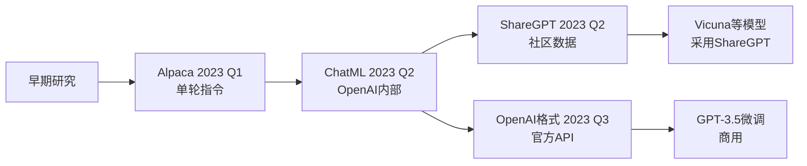

# 四大主流指令微调数据格式详解

## 1. **Alpaca格式**
### **名字来源**
- **Alpaca（羊驼）**：源自斯坦福大学2023年发布的 **Alpaca 模型**（基于LLaMA微调）。
- 这个名字延续了Meta的"动物命名传统"（Llama→羊驼），象征"轻量但实用"。

### **格式特征**
```json
{
  "instruction": "将下面的英文翻译成中文",
  "input": "Hello, how are you?",
  "output": "你好，你怎么样？"
}
```

### **核心设计理念**
- **单轮封闭任务**：每个样本是独立的指令-输出对
- **三段式结构**：
  - `instruction`：任务描述（必填）
  - `input`：任务输入（可选）
  - `output`：期望输出（必填）
- **完全自包含**：不依赖对话历史

### **优缺点**
- ✅ **优点**：简单、标准化、适合明确任务
- ❌ **缺点**：无法处理多轮对话、缺乏上下文感知

---

## 2. **ChatML格式**
### **名字来源**
- **Chat Markup Language（聊天标记语言）**：
  - 由**OpenAI**在ChatGPT API中提出
  - "ML"代表Markup Language（标记语言），类似HTML/XML的标签系统

### **格式特征**
```text
<|im_start|>system
你是有帮助的AI助手<|im_end|>
<|im_start|>user
介绍一下巴黎<|im_end|>
<|im_start|>assistant
巴黎是法国首都...<|im_end|>
<|im_start|>user
有哪些必看景点？<|im_end|>
<|im_start|>assistant
埃菲尔铁塔、卢浮宫...<|im_end|>
```

### **核心设计理念**
- **多轮对话流**：模拟真实聊天记录的线性结构
- **显式角色标记**：
  - `<|im_start|>` 开始标记
  - `<|im_end|>` 结束标记
  - 角色：system/user/assistant
- **无嵌套结构**：纯文本流，便于tokenizer处理

### **技术细节**
1. **特殊标记训练**：模型需要专门训练识别这些标记
2. **上下文窗口**：整个对话拼接成一个长序列
3. **系统提示**：支持固定的角色设定（system）

### **使用场景**
- **Qwen系列**：原生支持ChatML格式
- **DeepSeek**：也采用类似格式
- **对话模型微调**：需要多轮上下文的学习

---

## 3. **ShareGPT/Vicuna格式**
### **名字来源**
- **ShareGPT**：从[sharegpt.com](https://sharegpt.com)网站得名，用户分享ChatGPT对话的平台
- **Vicuna**：UC伯克利发布的对话模型，使用ShareGPT数据训练

### **格式特征**
```json
[
  {"from": "human", "value": "你好"},
  {"from": "gpt", "value": "你好！有什么可以帮助你的？"},
  {"from": "human", "value": "推荐几本书"},
  {"from": "gpt", "value": "《三体》《百年孤独》..."}
]
```

### **变体形式**
1. **原始ShareGPT格式**：`human`/`gpt`角色名
2. **通用化格式**：`user`/`assistant`
3. **带权重的格式**：某些数据标注质量权重

### **核心特点**
- **对话轮次数组**：JSON数组表示对话流
- **简单角色标记**：通常只用两个角色
- **真实对话数据**：来自用户与ChatGPT的实际交互

### **技术细节**
- **易于扩展**：可以添加元数据字段
- **格式灵活**：可以转换为其他格式
- **数据量大**：ShareGPT收集了数百万真实对话

---

## 4. **OpenAI API格式**
### **名字来源**
- 直接从**OpenAI Chat Completion API**的请求格式得来
- 官方微调API要求的数据格式

### **格式特征**
```json
{
  "messages": [
    {"role": "system", "content": "你是有帮助的助手"},
    {"role": "user", "content": "今天天气如何"},
    {"role": "assistant", "content": "我无法访问实时天气"},
    {"role": "user", "content": "那告诉我笑话"},
    {"role": "assistant", "content": "为什么鸡过马路..."}
  ]
}
```

### **核心设计理念**
- **API原生兼容**：与调用`gpt-3.5-turbo`的格式一致
- **消息列表**：按时间顺序排列的消息数组
- **三种标准角色**：system、user、assistant

### **技术细节**
1. **支持工具调用**：可以包含function/tool调用信息
2. **支持图像等多模态**：content可以是数组，包含文本和图像
3. **官方微调要求**：使用OpenAI微调API必须使用此格式

---

## **格式对比总结**

| 维度 | Alpaca格式 | ChatML格式 | ShareGPT格式 | OpenAI格式 |
|------|------------|------------|--------------|------------|
| **起源** | 斯坦福Alpaca模型 | OpenAI Chat模型 | ShareGPT网站数据 | OpenAI API |
| **结构类型** | 单轮指令对 | 多轮标记文本 | 多轮JSON数组 | 多轮消息列表 |
| **角色定义** | 无（隐式） | 显式标签标记 | 简单human/gpt | 标准role字段 |
| **系统提示** | 不支持 | 支持<system> | 通常不支持 | 支持system角色 |
| **数据来源** | 人工构建 | API/人工混合 | 真实用户对话 | API日志/人工 |
| **主要用途** | 单任务指令 | 开源对话模型 | 社区对话模型 | OpenAI微调 |
| **技术复杂度** | 低 | 中（需特殊标记） | 低 | 中（API兼容） |
| **流行度** | 中等（经典） | 高（开源主流） | 高（社区流行） | 高（官方标准） |

---

## **为什么需要这么多格式？**

### **历史发展路径**


### **技术选择指南**
1. **如果你是**：训练**单任务专家模型**
   - **推荐**：Alpaca格式
   - **原因**：简单直接，收敛快

2. **如果你是**：微调**开源对话模型**（Qwen, DeepSeek等）
   - **推荐**：ChatML格式
   - **原因**：模型原生支持，兼容性好

3. **如果你是**：使用**真实对话数据**训练
   - **推荐**：ShareGPT格式
   - **原因**：易于从网页导出数据转换

4. **如果你是**：使用**OpenAI微调API**
   - **必须**：OpenAI格式
   - **原因**：官方要求

### **格式转换关系**
几乎所有格式都可以相互转换：
- **Alpaca → ChatML**：添加角色标记
- **ShareGPT → OpenAI**：重命名字段
- **ChatML → 其他**：解析标记为结构化数据

### **未来趋势**
1. **标准化努力**：社区尝试统一为类似OpenAI的格式
2. **多模态扩展**：格式需要支持图像、音频等多模态输入
3. **工具调用集成**：格式需要支持function calling信息

---

## **实战建议**

### **对于Qwen模型开发者**
```python
# Qwen官方推荐使用ChatML格式
# 因为Qwen的tokenizer已预训练识别这些标记

from transformers import AutoTokenizer

tokenizer = AutoTokenizer.from_pretrained("Qwen/Qwen2.5-7B-Instruct")
# tokenizer已经知道如何处理<|im_start|>等标记
```

### **通用转换函数示例**
```python
def alpaca_to_chatml(alpaca_item):
    """将Alpaca格式转换为ChatML格式"""
    text = f"<|im_start|>user\n{alpaca_item['instruction']}"
    if alpaca_item.get('input'):
        text += f"\n{alpaca_item['input']}"
    text += f"<|im_end|>\n<|im_start|>assistant\n{alpaca_item['output']}<|im_end|>"
    return {"text": text}

def sharegpt_to_openai(sharegpt_conversation):
    """将ShareGPT格式转换为OpenAI格式"""
    messages = []
    for turn in sharegpt_conversation:
        role = "user" if turn["from"] in ["human", "user"] else "assistant"
        messages.append({"role": role, "content": turn["value"]})
    return {"messages": messages}
```

### **关键原则**
1. **优先使用目标模型原生支持的格式**
2. **保持数据格式一致性**：混合格式可能降低训练效果
3. **考虑推理时的使用场景**：训练格式应与推理时用户输入格式匹配

这些格式差异反映了不同的设计哲学和用例场景，了解它们能帮助你更好地准备训练数据和选择合适的模型架构。